# flutter_girlies_store

A Shopping / E-commerce application built with flutter from scratch.

## Screenshots

 
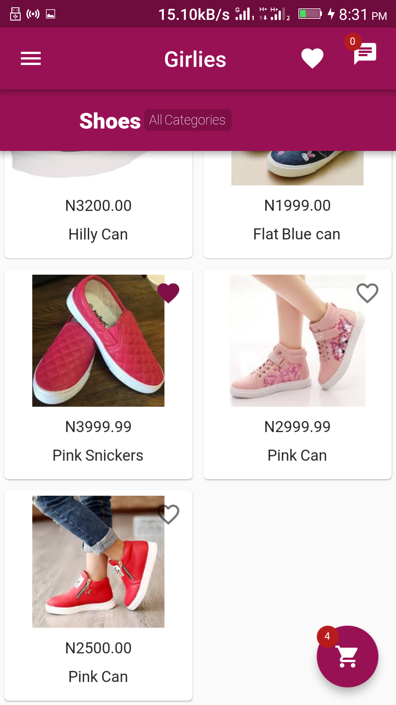 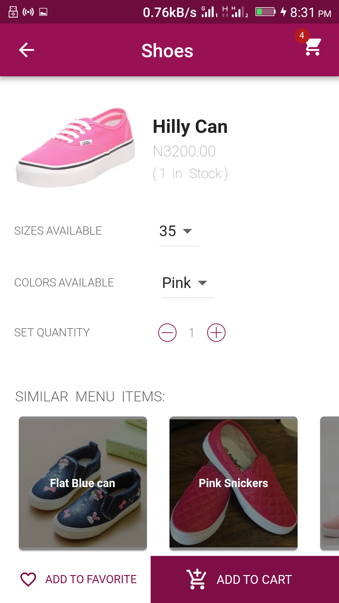
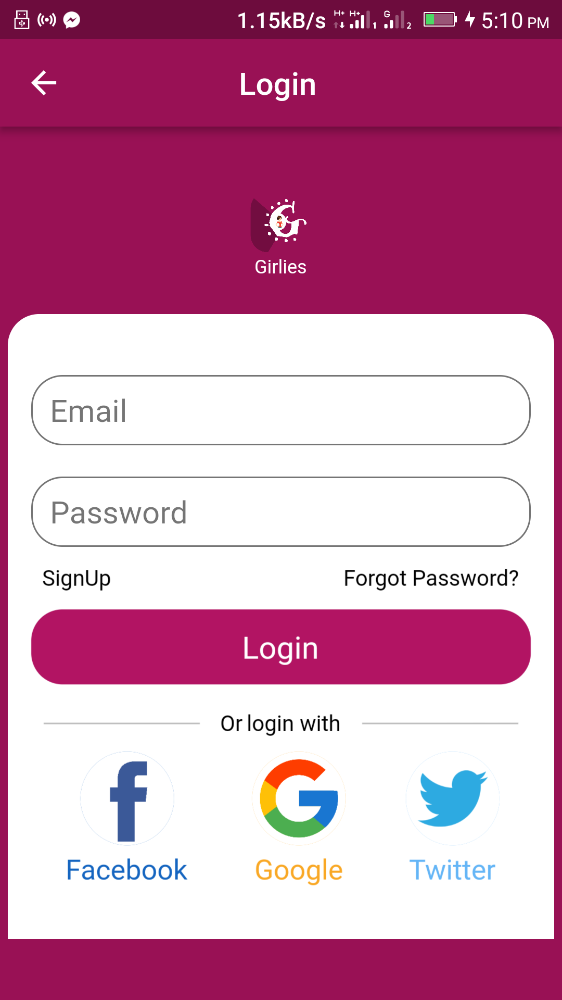 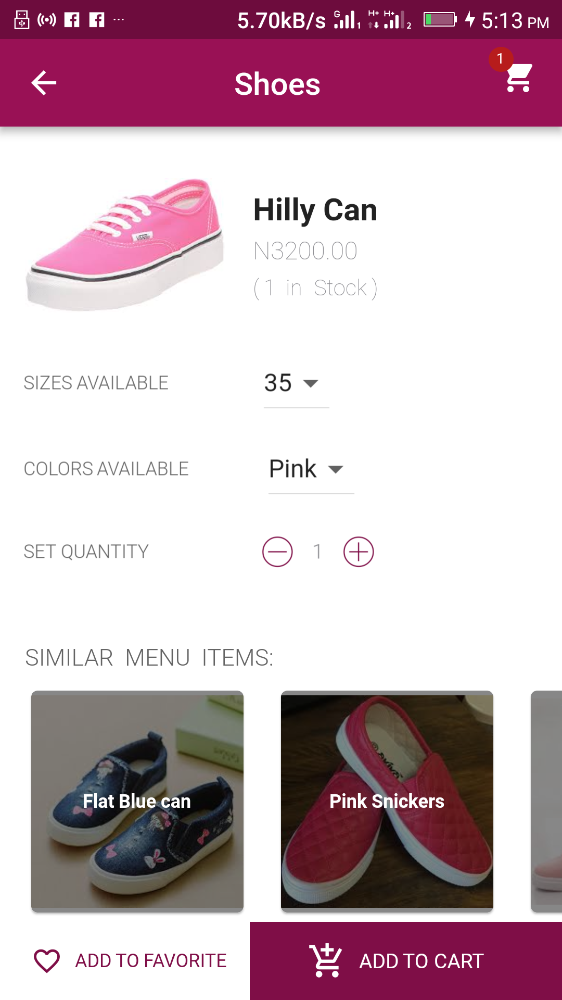
 
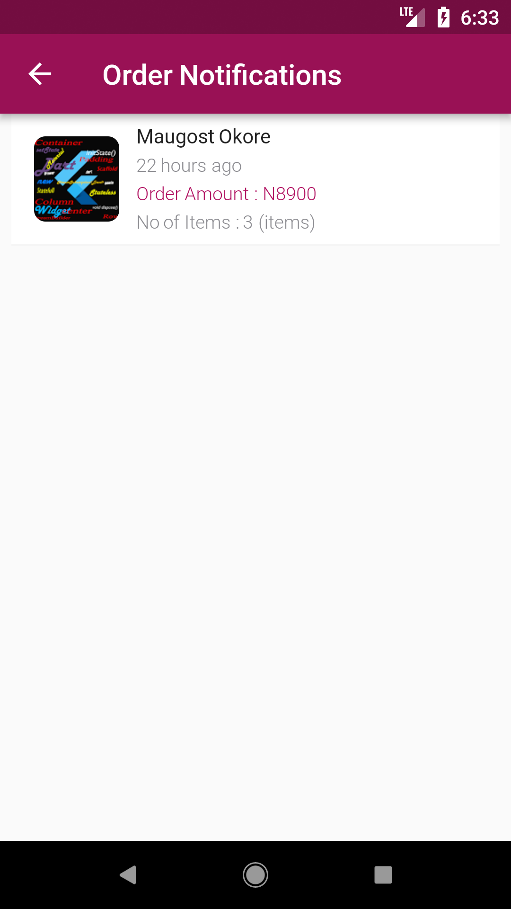 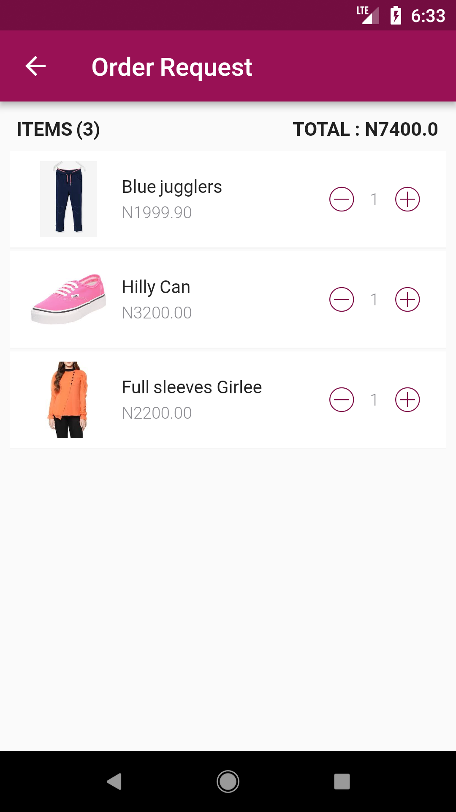
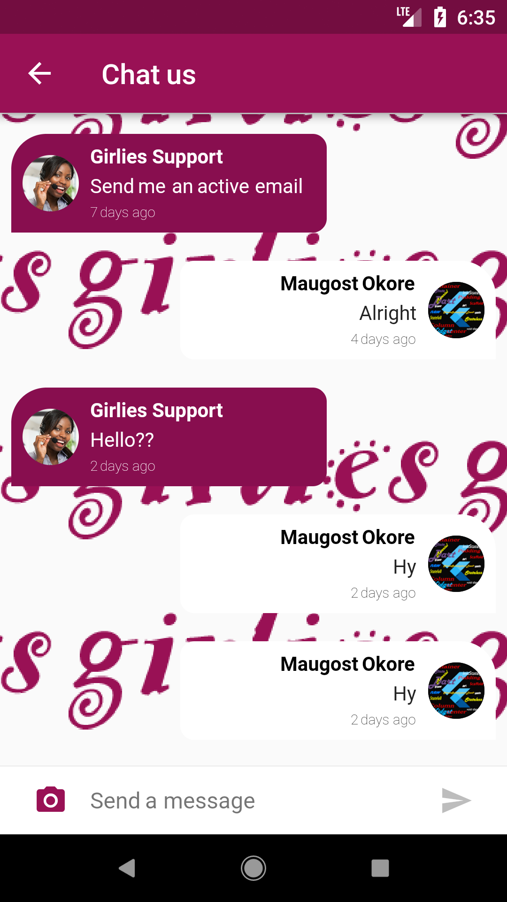 
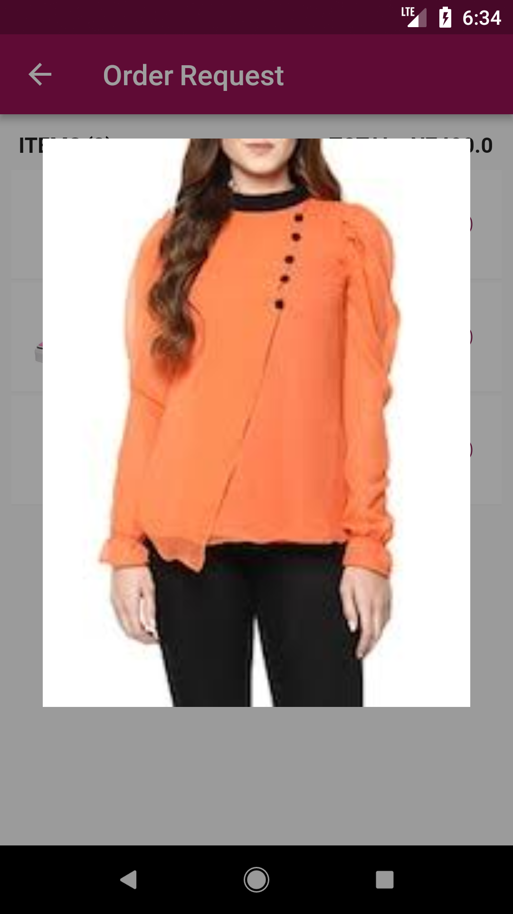 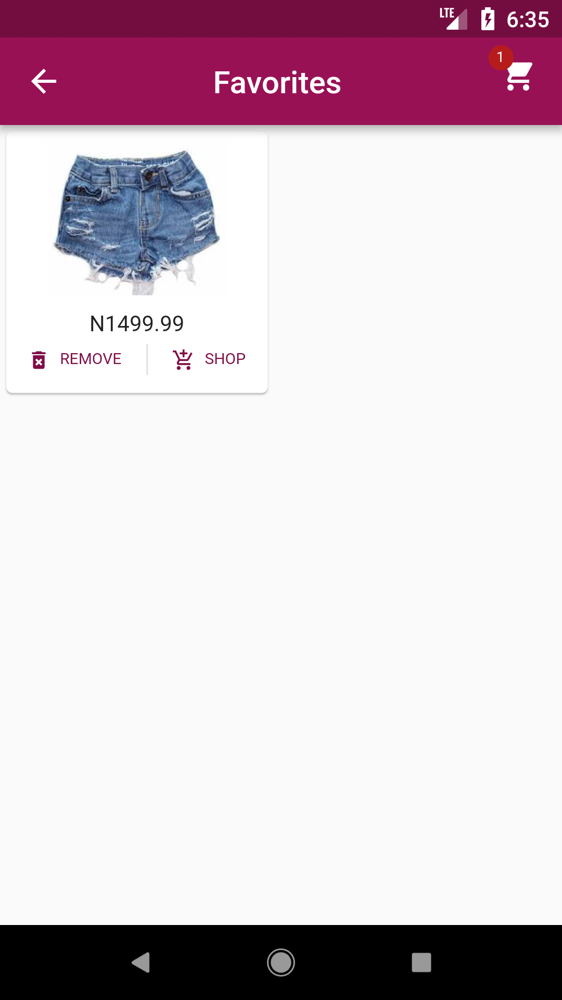
 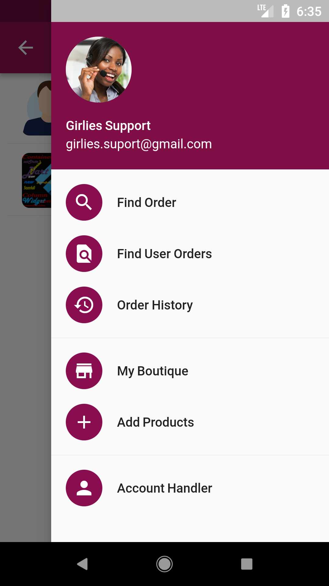
 
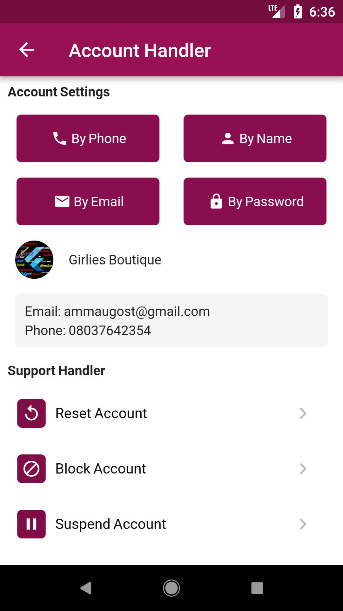 
 

### Show some :heart: and star the repo to support the project

This project isn't complete and it's not yet perfect but still under the development phase, please feel free to study the source code and checkout my new youtube channel were i'd be guiding and explaining the steps i took to build the App from scratch....

This repository containing links of all the example apps demonstrating features/functionality/integrations in [Flutter](https://flutter.io/) application development.

## YouTube Channels

[MTechViral](https://www.youtube.com/c/MTechViral)
[iamMaugost](https://www.youtube.com/channel/UCk3NXffAF04kM3q5uPXMU-Q/about)

## Facebook Group

[Let's Flutter](https://www.facebook.com/groups/425920117856409/)

# Pull Requests

I welcome and encourage all pull requests. It usually will take me within 24-48 hours to respond to any issue or request. Here are some basic rules to follow to ensure timely addition of your request:

1.  Match coding style (braces, spacing, etc.) This is best achieved using `Reformat Code` feature of Android Studio `CMD`+`Option`+`L` on Mac and `CTRL` + `ALT` + `L` on Linux + Windows .
2.  If its a feature, bugfix, or anything please only change code to what you specify.
3.  Please keep PR titles easy to read and descriptive of changes, this will make them easier to merge :)
4.  Pull requests _must_ be made against `develop` branch. Any other branch (unless specified by the maintainers) will get rejected.
5.  Check for existing [issues](https://github.com/mtellect/FlutterGirliesStore/issues) first, before filing an issue.
6.  Make sure you follow the set standard as all other projects in this repo do
7.  Have fun!

### Created & Maintained By

[Maugost_Mtellect](https://github.com/mtellect/)

> If you found this project helpful or you learned something from the source code and want to thank me, consider buying me a cup of :coffee: 
>
> *Bitcoin wallet address: 1K2wivc2xy7tTjsmHhNzq7wwEHoyHfS64n

# License

    Copyright 2018 Maugost Mtellect

    Licensed under the Apache License, Version 2.0 (the "License");
    you may not use this file except in compliance with the License.
    You may obtain a copy of the License at

       http://www.apache.org/licenses/LICENSE-2.0

    Unless required by applicable law or agreed to in writing, software
    distributed under the License is distributed on an "AS IS" BASIS,
    WITHOUT WARRANTIES OR CONDITIONS OF ANY KIND, either express or implied.
    See the License for the specific language governing permissions and
    limitations under the License.

## Getting Started

For help getting started with Flutter, view our online [documentation](https://flutter.io/).

For help on editing package code, view the [documentation](https://flutter.io/developing-packages/).